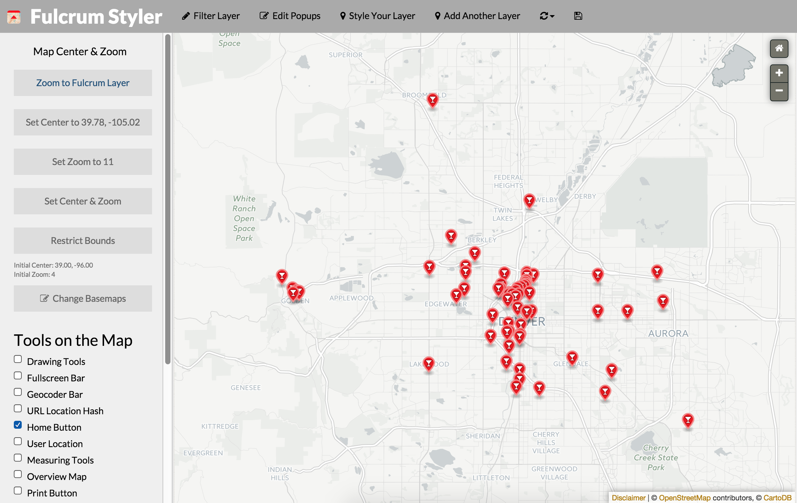

Style Your Fulcrum Map
======================

Filtering, styling, sharing and embedding are all important ways to get your hard work out in the open.  Fulcrum-Styler aims to make it easy to go through the data you have collected and style it customly. 

## View

There are a few ways you can 

## Build

If you want to create a production build with minified and combined Javascript and CSS with Grunt:

1. Install Node and NPM
2. `npm install`
3. `grunt`

The build will be created in the `_site` directory.

## License
Enjoy. MIT License, in other words:

  "A short, permissive software license. Basically, you can do whatever you want as long as you include the original   copyright and license notice in any copy of the software/source.  There are many variations of this license in 
  use." (https://tldrlegal.com/license/mit-license)

## Contributions and Special Thanks

This dashboard relies on [NPMap.js](https://github.com/nationalparkservice/npmap.js/), a Leaflet plugin that Nate Irwin created for the National Park Service.  There is also some features from the [NPMap-Builder](https://github.com/nationalparkservice/npmap-Builder) sprinkled in there.  Thanks so much to the @NPMap team for creating such useful tools and open-sourcing it.  You all are doing excellent work and leading the nation with government initiatives. 

